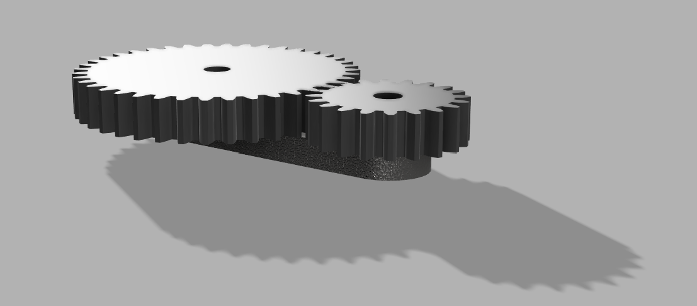
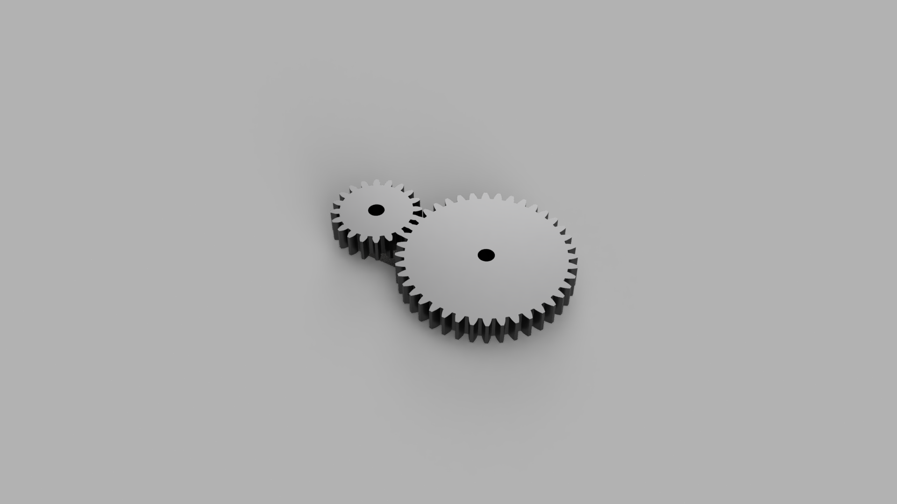
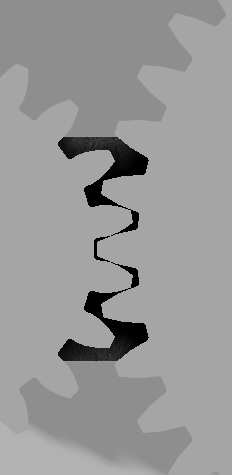
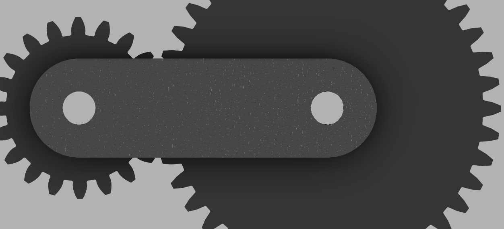

# 2:1 Spur Gear Reduction System

## Project Overview

The project is a 2:1 spur gear reduction design in Fusion 360, which has been validated using a Python script. It aimed at undergoing an iterative process of designing, calculating, identifying the problem, revising, and verifying, rather than simply making a CAD design.

The gears were designed with the right geometry for meshing, placed on a base plate and were then analyzed using a Python script that analyzed their gear ratio, their output speed/torque, and bending stress in the teeth of the gears based on Lewis Bending Equation. While validating the design, the initial design (V1) had failed the stress test with higher input load. The design was then revised (V2) by increasing the face width of the gears.

---

## 1. Mechanical Design Specifications

| Parameter | Input Pinion | Output Gear |
| :--- | :--- | :--- |
| Number of Teeth (N) | 20 | 40 |
| Module (m) | 2.5 mm | 2.5 mm |
| Pitch Diameter (d = m×N) | 50.0 mm | 100.0 mm |
| Pressure Angle | 20° | 20° |
| Face Width (V1) | 15 mm | 15 mm |
| Face Width (V2) | 25 mm | 25 mm |

- **Center distance:** m × (N1 + N2) / 2 = 2.5 × (20+40)/2 = **75.0 mm**, dimensioned directly in the base plate sketch and independently confirmed with Fusion's Measure tool.
- **Backlash:** 0.1 mm
- **Center bore / shaft hole:** 10 mm (both gears and base plate)

---

## 2. CAD Verification: Interference Check

Once the gears were assembled with the Revolute joints and a Motion Link (2:1 ratio, reverse direction), an official Interference Check was performed using Fusion 360. In the first trial, there was an actual solid-to-solid collision (452.4 mm³) due to the misalignment of the teeth of the gears. The problem was solved by changing the rotation of the joint of the pinion by -9°, upon which time the Interference Check returned “No interference detected.”

---

## 3. Validation Testing Summary

| Test | Version | Input Torque | Face Width | Safety Factor | Result |
| :--- | :--- | :--- | :--- | :--- | :--- |
| Run 1: Baseline | V1 | 5.0 Nm | 15 mm | 8.45 | PASS (over-engineered for this load) |
| Run 2: Stress Test | V1 | 40.0 Nm | 15 mm | 1.06 | FAIL (below 1.5 threshold) |
| Run 3: Revision | V2 | 40.0 Nm | 25 mm | 1.76 | PASS |

**A note on input torque:** the 5.0 Nm and 40.0 Nm values were not measured from a physical motor — no hardware was built for this project. They were chosen to represent a light load and a deliberately heavier stress-test load, to demonstrate the calculation and design-revision process realistically.

**A note on material:** stress calculations assume mild steel with an allowable bending stress of ~140 MPa, used as a reasonable general reference value for a first-pass design. This is not tied to a specific certified material grade, since the gears were not manufactured or tested.

---

## 4. Script Execution Logs

Full input/output records for all three runs are in [`results_log.txt`](results_log.txt).

---

## 5. Renders, Video, and CAD Files

### V1 — Original Design (15mm face width)

### V2 — Revised Design (25mm face width)

### Rotation Videos
- [Motion Link demo (automatic rotation)](gear_rotation_v1_2.mp4)
- [Manual rotation test](gear_rotation_v1_1.mp4)

### CAD Files
- [Gear_Reduction_System_V1.f3z](Gear_Reduction_System_V1.f3z)
- [Gear_Reduction_System_V2.f3z](Gear_Reduction_System_V2.f3z)

*(Exported as `.f3z` — Fusion 360's archive format — since native `.f3d` files live in Fusion's cloud storage rather than as a standalone local file.)*

---

## 6. Script

[`gear_calc.py`](gear_calc.py) — calculates gear ratio, output RPM/torque, Lewis bending stress, and safety factor for a given set of gear parameters and load.

---

## Scope Note

This is a self-directed CAD + calculation design project. No physical hardware, motors, or manufacturing were involved — all mechanical loads are assumed values used to demonstrate the design and validation process, not measured data.
